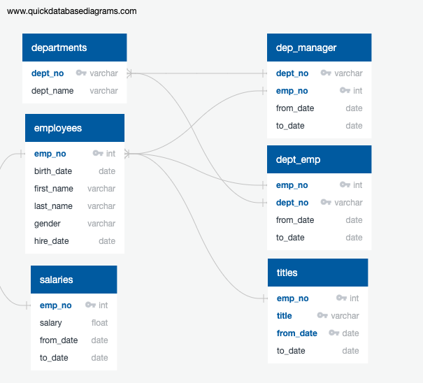
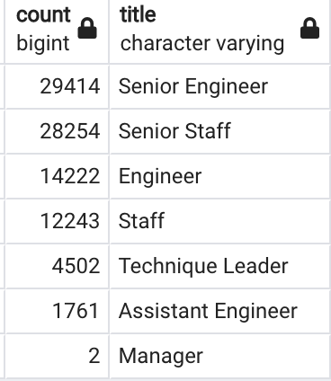
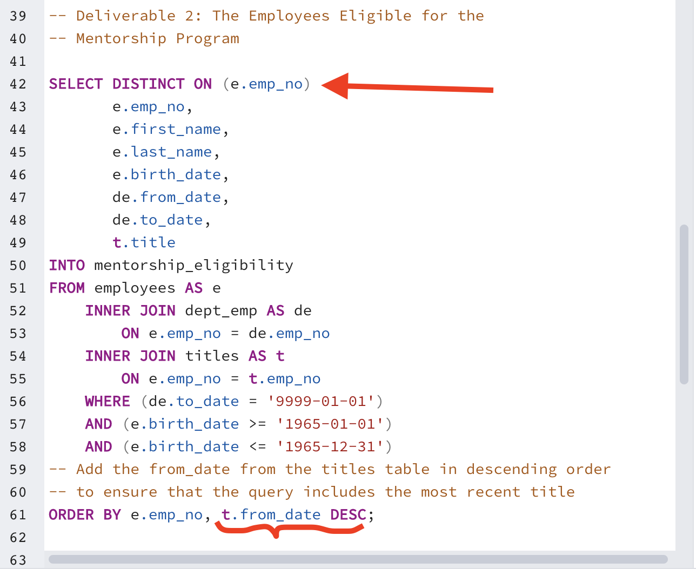
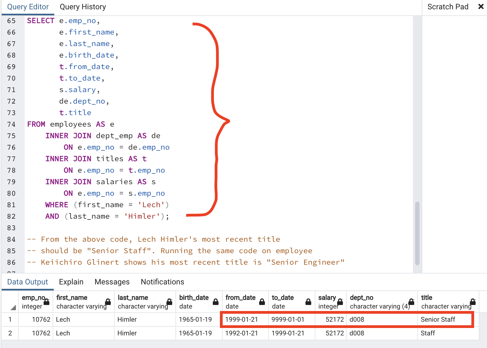
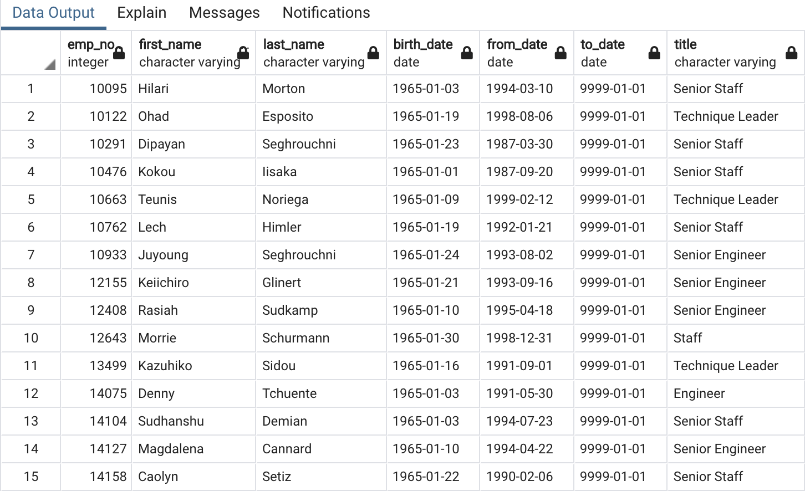

# Pewlett Hackard Analysis

## Project Overview

Pewlett Hackard, a long standing company with several thousand employees, has requested our assistance in analyzing several plans involving retirement as some of its *"baby boomer"* employees reach retirement age, and identify the resulting job openings this would create. Pewlett Hackard plans to offer a retirement package to employees that meet certain age criteria, as well as a mentorship program where some of these retiring employees can train the next generation. 

## Methodology

The employee data was provided in six csv files, each contaning relevant information. These files are included in the *Data* folder of this repository, and are identified as:

* *current_emp.csv*
* *departments.csv*
* *dept_emp.csv*
* *employees.csv*
* *salaries.csv*
* *titles.csv*

We were asked to perform our analysis in SQL, to improve the robustness of the information for future use by the H.R. Department. To do this, we first mapped the schema for the data tables contained in each csv file into an *ERD* in order to identify the primary and foreign keys. 

Then, we imported the tables into an *SQL* database using *pgAdmin* and *PostgreSQL*, and used the query tools provided by these platforms to perform a series of queries, join different tables, produce new tables and summarize the results in additional csv files.

## Results

Provide a bulleted list with four major points from the two analysis deliverables. Use images as support where needed

### Number of Retiring Employees by Title

The data was saved to a new table as *retiring_titles.csv*.

### Employees Eligible for Mentorship Program

In performing the suggested methodology for extracting the list of employees eligible for the mentorship program, we noticed that it was not querying the most current title for some employees. 

This was because the *from_date* in the Department Employee table (*dept_emp.csv*) on which the sort order was being made in conjunction with the DISTINCT ON () function only captured part of the current employees information. It did capture its current department, but if the employee had been promoted after joining the department, that employees current title was not being necessarily queried. Instead, we based our sort on the *from_date* field in the Titles table (*titles.csv*) to get the most current title. The SQL query code used was as follows:

And to confirm that it was correctly selecting the most current title, we queried several employees to confirm our results. The example below is for employee Lech Himler (employee no. 10762), which appears with the incorrect title on the table presented in the rubric.

Running the query again with the corrected code produced a table with the most current titles as shown below:

The corrected data was saved to a new table as mentorship_eligibility.csv.

## Summary

In commissioning the analysis project, Pewlett Hackard set out to answer two pressing issues associated with the wave or retirements, or the *"silver tsunami"* as the looming retirement wave has been termed by H.R. management. These two issues are:

* How many roles will need to be filled as the *"silver tsunami"* begins to make an impact?

* Are there enough qualified, retirement-ready employees in the departments to mentor the next generation of Pewlett Hackard employees?

To answer these two questions, we ran additional queries to generate summary data, which was stored in new csv files. In the process, we were carefull to ensure that both the most current department and most current title was selected for each employee.

We created three summary tables (these are included in the *Data* folder of this repository and the query codes are included in the *Employee_Database_challenge.sql* file):

* a summary of all employee count grouped first by department and then by title (*summary_dept_title_count.csv*).
* a summary of the retiring employee count grouped first by department and then by title (*summary_ret_dept_title_count.csv*).
* a summary of all eligible mentorship employee count grouped first by department and then by title (*summary_ment_dept_title_count.csv*).

The summary by retiring employee count produced the following table:

It shows that there are 38 unique roles that will be affected by the retirement wave, considering that each unique role is a combination of a title associated with a given department (you cannot assume that the same title is interchangeable between departments as they will certainly involved different skill sets).

To answer the second question, we combined the three summary tables using a *LEFT JOIN* on the summary table for all employee count, and generated a new csv file stored as *grand_summary.csv*. We then exported this file to excel and conducted a Pivot Table to facilitate the presentation of the data. The pivot table is included in the *Data* folder of this repository as *Summary Pivot Table.xlsm*.

The resulting pivot table shown above highlights several challenges with the mentorship program. Although in most cases, there seem to be enough mentors to train the new generation of employees, there are cases where there are too few (for example, in the roles of Assistant Engineer in the Quality Management department and Technique Leader in the Customer Service department), or there are none (in the case of Manager roles for several departments). Of particular concern, there seems to be few if any mentors in critical departments such as Research, where there are no mentors for the single retiring manager, and no mentors for the 32 of 127 retiring Assistant Engineers. A similar situation occurs with Quality Management and Production departments.

We would recommend that Pewlett Hackard broadens the reach of the mentorship program to cover these important gaps.